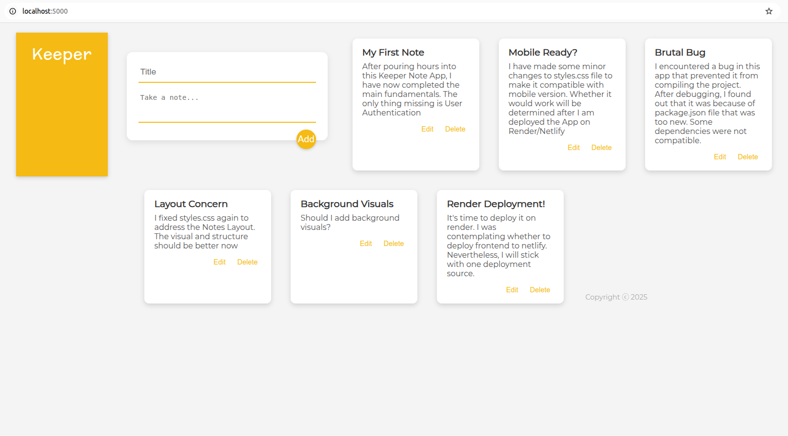

# Keeper Note App

A minimalist full-stack note-taking app built with the **MERN stack**. Designed to be clean, fast, and fully responsive, this app demonstrates end-to-end CRUD functionality and cloud deployment using **React**, **Express**, and **MongoDB Atlas**.

---

### Live Demo  
[Launch the App](https://keeper-note-app.onrender.com)  
*Note: The server may take a few seconds to wake up on first load (hosted on Render).*

---

### App Preview  

---

### Why I Built This  
Note-taking is a common productivity need, but many tools are bloated or overly complex. I built Keeper as a lightweight solution to practice building a full-stack app with seamless frontend-backend integration, and to refine my skills in **React, RESTful APIs, and cloud deployment**.

---

### Features  
- 📝 Create, edit, and delete notes  
- ⚡ Real-time UI updates with React Hooks  
- ☁️ Cloud data persistence with MongoDB Atlas  
- 📱 Fully responsive on desktop and mobile  
- 🌐 Deployed as a single-page app on Render

---

### Tech Stack

- **Frontend:** React (Hooks), Vite, Custom CSS  
- **Backend:** Node.js, Express.js, MongoDB  
- **Other:** Mongoose, dotenv, Render
